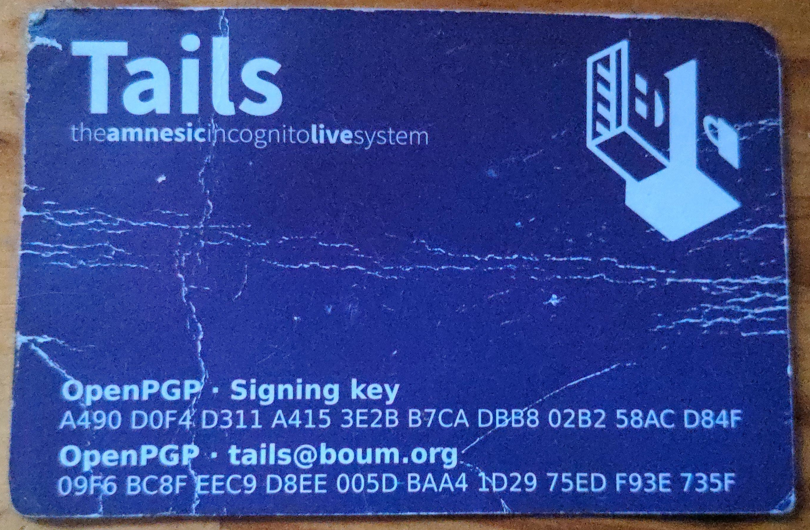

### Tails

##### Contributing to the PGP web of trust #####
The tails team gave me this business card at a tech conference years ago. It contains the fingerprint for [the OpenPGP key](./tails_signing_key.asc) used to sign their [tailsOS releases](https://tails.net/install/index.en.html) (Signing key) and also the fingerprint for the key they use to encrypt emails using OpenPGP. Putting their business card here allows others to check for the authenticity of their downloads.



*Signing key fingerprint:* 

```A490 D0F4 D311 A415 3E2B  B7CA DBB8 02B2 58AC D84F```

*Subkey fingerprint (TOFU 19/09/24):*

```CEB3 6DE7 8572 8E70 8F59  3B75 C69F F0E4 C08F 8209```
